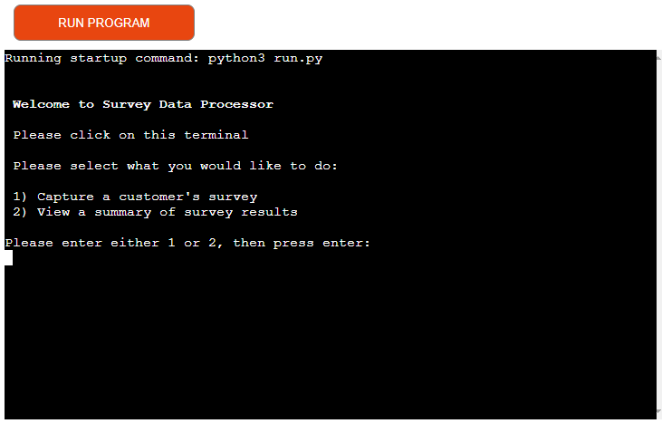

# Survey Data Processor

## Conception

- My first step was to create a flow diagram of my scope for the Survey Data Processor concept.

- Here is an overview of the intial concept:

 

I decided to create a data processor for capturing and processing survey data of a customer satifaction questionaire for a ficticious new cellphone that was launched. It must allow users to input survey ratings, validate the users input, allocate the data with an entry number, store the validated data on Google Sheets while also allowing the user to get a summary report of captured and stored data from the surveys captured. I also wanted to create a function that would create generic survey data for filling the worksheet with data to process and add the functionality for the user to email the summary results.

- After my project conception session with my mentor, we decided to proceed without the functiontionality to create generic survey data and email the summarised results, reason being that he thought it might be a bit ambitious with the amount of time at hand. I am now very greatfull for his input.

- This was now the scope of my project:

 

## Setup of Gitpod Workspace and resources

I made use of Code Institutes "Love Sandwiches Walkthrough Project", "Getting Set Up" course videos for the following:
 - [Creating a Google Sheet](https://youtu.be/4MWpwuPpSCA).
 - [To activate API credentials](https://youtu.be/WTll5p4N7hE).
 - [Setup of Gitpod Workspace](https://youtu.be/3ikrLWM0QqU).
 - [Connecting to the API with Python](https://youtu.be/lPTKUiafTRY).

## Features

### Existing Features

- When initializing the program, the user is dispalyed a welcome message, instructions and options either to capture a customer survey or view a summary of the results captured thus far.

 

- User input is validated by the program and will display custom error messages that are highlighted in red if the user has made some form of invalid entry and the question will be repeated in the terminal.

 

- If the user selects the first option and presses enter, instructions for capturing a survey are presented to the user.

 

- If the user makes an invalid entry, the user will be presented with a custom error message highlighted in red and the instructions will be repeated on the terminal.

 

- Sample error messages:

 

 

- Once a valid entry is provided, the user will be presented with feedback of the running processes taking place and returned to the home screen.

 

 

- If the second option is selected, then the user will be displayed a summary of results by catergory as well as a total number of surveys captured.

 

## Data Model

- I decided to use Google sheets to store and hold all the data for the Survey Data Processor.
- When capturing a survey entry, once the program has validated the users inputs, the validated data is sent and saved to a predesigned worksheet with a self generated capture number allowcated.

 

 - When a user selects the option to view a summary of the captured survey results, the program fetches all the necessary data from the relevant cells in the worksheet and uses this stored data to calculate the summary results.

## Testing

- Made use of the terminal window and print function on multiple occasions in order to view data and check if functions work as expected.

- Tested data_validator function with various data types and amounts of data provided:

 - If less than the required amount of values are provided - ValueError raised as intended.
 - If more than the required amount of values are provided  - ValueError raised as intended.
 - If a non numerical string is provided by the user - ValueError raised as intended.
 - If each supplied interger from the user is between the minimum and maximum required - ValueError raised as intended.

- Tested if program is updating the Google worksheet correctly - Working as intended.
- I also made use of the Python type method (**type()**) in order to check data types of returned results where needed.

### Validator Testing

- Made use of the [PEP8](http://pep8online.com/) online validation tool for systematic validator testing.

#### Initial Validator Tests

- Initial validator test for run.py results:
 - Found **E402** error with position of Google-auth module level import - **Resolved** by changing position and eliminating unneccessary commenting.
 - Found 2 errors **(W291 and W293)** for "whitespace" in code - All **Resolved**
 - Found 6 **E501** errors for length of line used - All **Resolved**
 - Found **E302** error for only spacing with 1 blank line instead of 2 - **Resolved**

### Final Validator test

- Final validation returned no errors.

### Unfixed Bugs

- All bugs have been attended to and resolved.

## Deployment

- This application is deployed on [Heroku](https://id.heroku.com/login) as described by Code Institute in the Love Sandwiches walkthrough project [deployment video Part 1](https://youtu.be/BhW26FryaYI) and [deployment video Part 2](https://youtu.be/ONx3iEqAOM4) and these were the neccessary steps in the order that they need to be done:

 1. Firstly I added a new line character (\n) to the end of the text of any input methods due to a software issue as describe in the tutorial, in order to display the input method's text in the terminal as intended.
 2. I create a list of requirements as described in the tutorial in order for the program to run as intended, Heroku will need these dependencies in order to run the application on the deployed site.
 3. I opened Heroku and on the dashboard page click on the "NEW" button and select the "Create a new app" option.
 4. On the new page that opens, I named my app, selected my region and then clicked on the "Create app" button.
 5. On the new page select the settings tab.
 6. On the new page, in the config vars section, I selected the "Reveal Config Vars" button.
 7. Next I selected the "Key" input field and typed in "CREDS" as the key.
 8. I then copied my creds.json file content and pasted that into the "Value" input area, and clicked the "Add" button.
 9. Next I added the word "PORT" as another "Key" with "8000" as the "Value" and again clicked on the "Add" button.
 10. I then selected the "Add buildpack" button, then first selected the "Python" option and saved the changes.
 11. I repeated the previous step but this time selected the node.js option and saved this buildpack change.
 12. I then selected the "Deploy" tab on the top of the page.
 13. I then selected "Github" as my deployment method and clicked on the "Connect to Github" button.
 14. Next I searched for this app's repository in the "Connect to Github" section of the page and clicked on connect on order to connect the repository to this application.
 15. Next I clicked on the "Deploy Branch" button in the "manual Deploy" section of the page.
 16. Once the app was built, I selected the "View" button under the now visible "Your app was successfully deployed" message in order to view the page of the now running application.
 17. After previewing the running application I went back to the previous page and toggled the "Enable Automatic Deploys" button so that the app would automatically update when a change is pushed to Github.

Here is the live link [Survey Data Capture and Extraction Application](https://survey-data-capture-extract.herokuapp.com/)

## Deployment Testing

- Found bug with how print statements are displayed on deployed site in relation with how they are inputted into workspace to avoid line being too long as described by PEP8 validator - **Resolved** by correct use of quotation marks, indentation and new line characters (\n), I managed to resolve all my display issues on the deployed site.
- I ran multiple tests on how print statements appear in the terminal and adjusted to what I feel is a good user experience, trying to keep the operation logical, simple, clean and easy to use.

## Credits

- First and foremost I would like to thank my mentor Anthony for his valuable input.
- Code institutes Course material was essential for setting up a workspace and deployment of the program on [Heroku](https://id.heroku.com/login).
- I made use of [Lucidchart](https://www.lucidchart.com/pages/) to create the flow diagrams for the palnning of my project.
- I sourced the code for printing coloured text to the terminal from [lycaeum.dev](https://lycaeum.dev/en/questions/287871).
- I researched and made use of basic Markdown syntax sourced on [markdownguide.org](https://www.markdownguide.org/basic-syntax/).
- I sourced a solution on how to allow messages on the terminal to sleep if needed as well as a solution for clearing the terminal when needed from [geeksforgeeks.org](https://www.geeksforgeeks.org/clear-screen-python/)

### Content

- Commit comment conventions were taken from [Cheatography](https://cheatography.com/albelop/cheat-sheets/conventional-commits/), I do not totally understand all the vernacular but tried my best to implement it as best I could.
